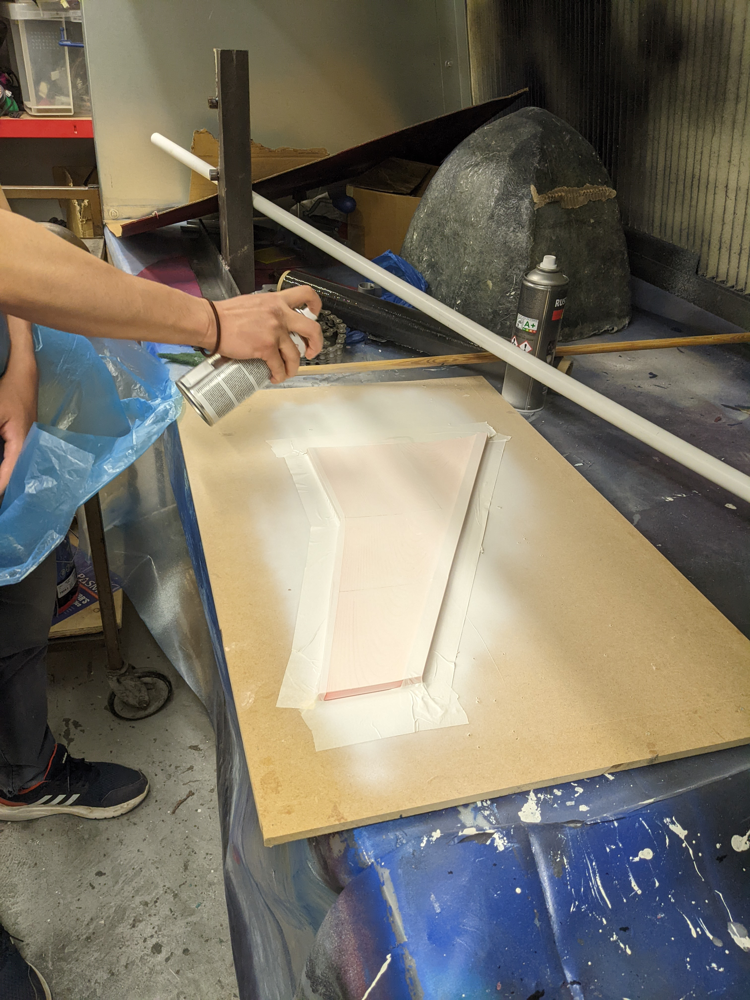

This week the team began practicing the main manufacturing method to be used in the final build.

<!-- truncate -->

A simple half-scale mould for the lower surface of the wing was 3D printed and work is being carried out to prepare the mould for the laying of the carbon fibre. This work mainly consists of priming and surface finishing.

<!-- After producing a half scale flat model of the wing, the team began to practice manufatucring of the model. Two layers of primer has been added and cured over the past few days, ready for sanding and laying. -->

