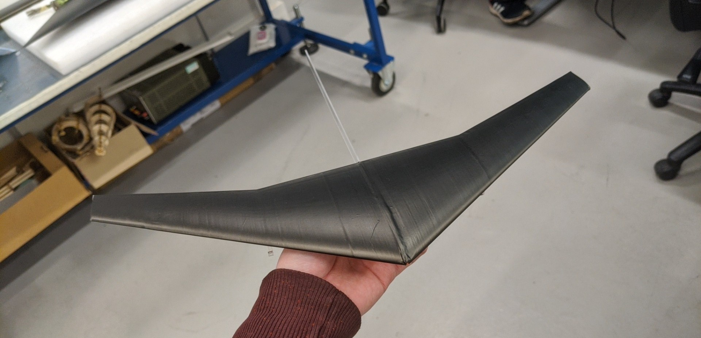

A quarter scale wind tunnel model of the main wing planform has been completed and is ready for testing when space opens up at City's T2 low speed wind tunnel.

<!-- truncate -->

The model was 3D printed in two halves at 1/4 quarter scale and later assembled with some metal bars running across the span of the model to ensure the strength of the model and that the load is transferred succesfully to the T2 wind tunnel's force balance.

The model was additionally wrapped in vinyl for two purposes:
* to aid in producing a cleaner finish to the model after assembly
* to allow for flow-visualisation to be carried out if time permits.